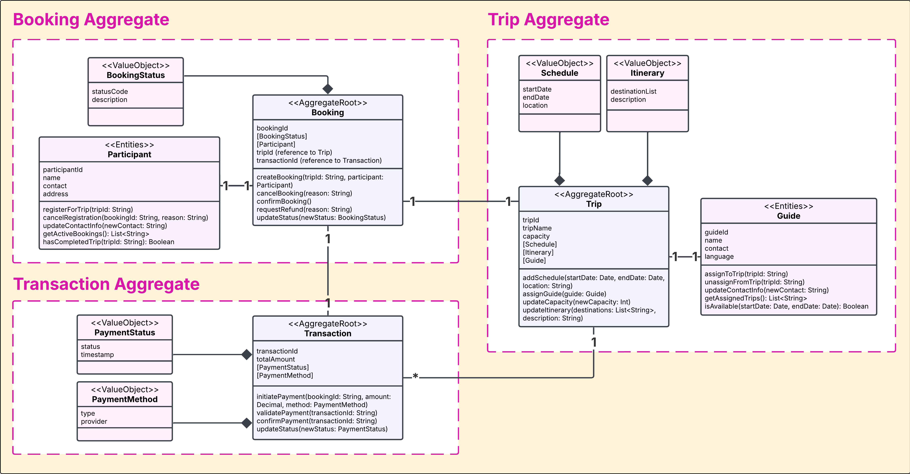
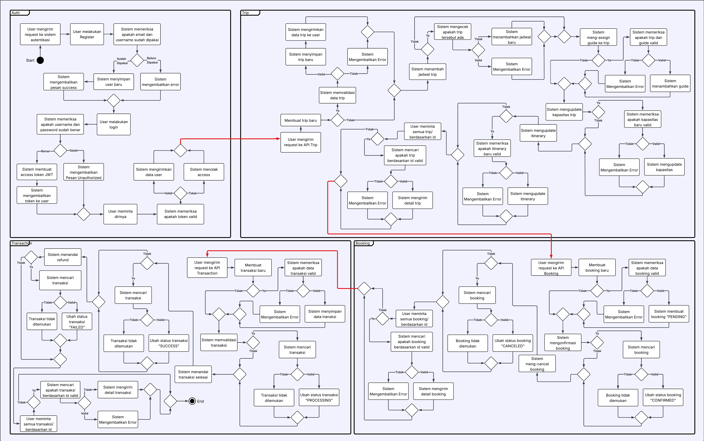
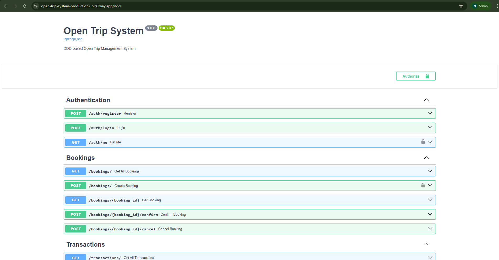
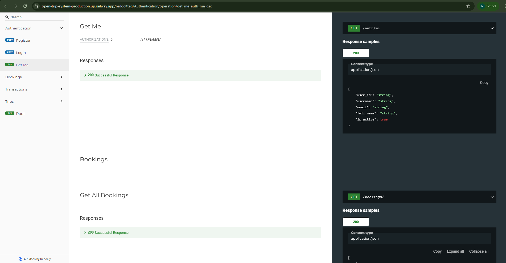

# Open Trip System

<div align="center">
	<a href="https://open-trip-system-production.up.railway.app">
		
	</a>
</div>

Sistem manajemen open trip berbasis Domain-Driven Design (DDD) yang dibangun dengan FastAPI.

## Architecture Overview




> **Catatan:** Activity diagram merupakan hasil pemetaan dari class diagram yang telah disesuaikan dengan endpoint dan alur kerja sistem. Activity diagram ini juga dibuat setelah penambahan fitur autentikasi (auth), karena auth bukan bagian dari aggregate yang tercantum pada class diagram.

Dalam sistem ini, ditetapkan **tiga aggregate utama** yang membentuk proses inti dalam **Booking Context**. Setiap aggregate memiliki:

- **Aggregate Root**: Entitas utama yang mengontrol akses ke semua objek dalam aggregate
- **Value Objects**: Objek immutable yang merepresentasikan konsep domain
- **Entities**: Objek yang memiliki identitas unik

Invariants ini dicek dan ditegakkan di dalam **Aggregate Root** melalui metode atau logika yang mengontrol perubahan state.


## Project Structure

```
open-trip-system/
│
├── .coverage
├── .git/
├── .github/
│   └── workflows/
│       └── ci.yml
├── .venv/
├── backend/
│   ├── auth.py
│   ├── main.py
│   ├── requirements.txt
│   ├── storage.py
│   ├── booking/
│   │   ├── aggregate_root.py
│   │   ├── booking_api.py
│   │   ├── entities.py
│   │   └── value_objects.py
│   ├── transaction/
│   │   ├── aggregate_root.py
│   │   ├── transaction_api.py
│   │   └── value_objects.py
│   ├── trip/
│   │   ├── aggregate_root.py
│   │   ├── entities.py
│   │   ├── trip_api.py
│   │   └── value_objects.py
│   └── tests/
│       ├── test_auth.py
│       ├── test_booking.py
│       ├── test_main_edge.py
│       ├── test_storage.py
│       ├── test_transaction.py
│       └── test_trip.py
├── doc/
├── frontend/
├── pyproject.toml
└── README.md 
```


## Continuous Integration (CI)

Repository ini menggunakan Github Actions sebagai CI untuk memastikan codebase selalu teruji, terlinting, dan memiliki coverage yang baik secara otomatis setiap ada perubahan kode. Status build dapat dipantau melalui badge di atas.

- **Python** - Programming language
- **FastAPI** - Modern web framework for building APIs
- **Uvicorn** - ASGI server for running FastAPI applications
- **Pydantic** - Data validation and parsing
- **python-jose** - JWT creation and verification
- **Passlib[argon2]** - Secure password hashing
- **pytest, pytest-cov** - Unit testing and coverage
- **Github Actions** - Continuous Integration (CI)

## Authentication & JWT

Sistem menggunakan autentikasi berbasis JWT (JSON Web Token) untuk mengamankan endpoint yang membutuhkan login. Pengguna melakukan registrasi dan login, lalu mendapatkan access token (JWT) yang harus dikirimkan pada header `Authorization: Bearer <token>` untuk mengakses endpoint yang dilindungi. Token ini berisi informasi user (payload) dan memiliki masa berlaku tertentu (default 30 menit). Password pengguna di-hash menggunakan algoritma Argon2 sebelum disimpan, sehingga tidak pernah disimpan dalam bentuk plaintext. Semua proses verifikasi token dan otorisasi user dilakukan di file `auth.py`.


## Endpoint Autentikasi
Tabel berikut merupakan daftar endpoint yang digunakan dalam sistem autentikasi JWT beserta hak akses dan fungsinya melalui file `auth.py`.

| Endpoint        | Method | Akses                        | Deskripsi Singkat                                      |
|-----------------|--------|------------------------------|--------------------------------------------------------|
| /auth/register  | POST   | Publik                       | Registrasi user baru dengan validasi email & username unik |
| /auth/login     | POST   | Publik                       | Login dan mendapatkan access token                     |
| /auth/me        | GET    | Perlu Autentikasi (Bearer)   | Mendapatkan informasi user yang sedang login           |

## Endpoint Trip
Tabel berikut menyajikan daftar endpoint yang tersedia pada Aggregate Trip melalui file `trip_api.py`.

| Endpoint                        | Method | Deskripsi Singkat                        |
|----------------------------------|--------|------------------------------------------|
| /trips                           | POST   | Membuat trip baru                        |
| /trips/{trip_id}/schedule        | POST   | Membuat jadwal baru untuk trip           |
| /trips/{trip_id}/guide           | POST   | Meng-assign Guide untuk trip             |
| /trips/{trip_id}/capacity        | PUT    | Memperbarui kapasitas trip               |
| /trips/{trip_id}/itinerary       | PUT    | Memperbarui itinerary trip               |
| /trips/                          | GET    | Mengambil seluruh data trip              |
| /trips/{trip_id}                 | GET    | Mengambil detail trip berdasarkan ID     |

## Endpoint Booking
Tabel berikut menyajikan daftar endpoint yang tersedia pada Aggregate Booking melalui file `booking_api.py`.

| Endpoint                        | Method | Deskripsi Singkat                                    |
|----------------------------------|--------|------------------------------------------------------|
| /bookings/                      | POST   | Membuat booking baru                                 |
| /bookings/{booking_id}/confirm  | POST   | Mengonfirmasi booking (PENDING → CONFIRMED)          |
| /bookings/{booking_id}/cancel   | POST   | Membatalkan booking                                 |
| /bookings/                      | GET    | Mengambil seluruh booking                            |
| /bookings/{booking_id}          | GET    | Mengambil detail booking berdasarkan ID              |

## Endpoint Transaction
Tabel berikut menyajikan daftar endpoint yang tersedia pada Aggregate Transaction melalui file `transaction_api.py`.

| Endpoint                                 | Method | Deskripsi Singkat                        |
|-------------------------------------------|--------|------------------------------------------|
| /transactions/                           | POST   | Membuat transaksi baru                   |
| /transactions/{transaction_id}/validate  | POST   | Memulai pemrosesan transaksi             |
| /transactions/{transaction_id}/confirm   | POST   | Menyelesaikan transaksi                  |
| /transactions/{transaction_id}/refund    | POST   | Menandai transaksi gagal                 |
| /transactions/                           | GET    | Mengambil seluruh transaksi              |
| /transactions/{transaction_id}           | GET    | Mengambil detail transaksi berdasarkan ID|

## Deployment

Sistem ini telah dideploy di Railway dan dapat diakses melalui URL berikut:

- [https://open-trip-system-production.up.railway.app](https://open-trip-system-production.up.railway.app)
	- [Swagger UI (docs)](https://open-trip-system-production.up.railway.app/docs)
	- [ReDoc](https://open-trip-system-production.up.railway.app/redoc)




---

## Getting Started

### Prerequisites

- Python 3.8+
- pip (Python package manager)

### Installation

1. Clone the repository
```bash
git clone <repository-url>
cd open-trip-system
```

2. Install dependencies
```bash
pip install fastapi uvicorn
```

### Running the Application

1. Navigate to the backend directory
```bash
cd backend
```


2. Run the application using Uvicorn
```bash
uvicorn main:app --reload
```

### Running Tests & Coverage

Untuk menjalankan seluruh unit test dan melihat coverage, gunakan perintah berikut dari root project:
```bash
pytest --cov=backend --cov-report=term-missing backend/tests
```
