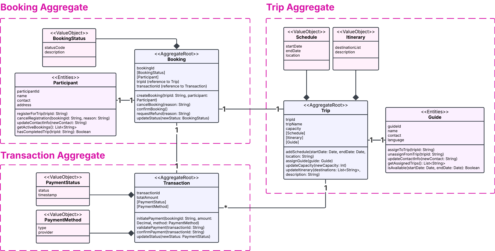

# Open Trip System

Sistem manajemen open trip berbasis Domain-Driven Design (DDD) yang dibangun dengan FastAPI.

## Architecture Overview



Dalam sistem ini, ditetapkan **tiga aggregate utama** yang membentuk proses inti dalam **Booking Context**. Setiap aggregate memiliki:

- **Aggregate Root**: Entitas utama yang mengontrol akses ke semua objek dalam aggregate
- **Value Objects**: Objek immutable yang merepresentasikan konsep domain
- **Entities**: Objek yang memiliki identitas unik

Invariants ini dicek dan ditegakkan di dalam **Aggregate Root** melalui metode atau logika yang mengontrol perubahan state.


## Project Structure

```
open-trip-system/
├── backend/
│   ├── booking/
│   │   ├── aggregate_root.py    # Booking Aggregate Root
│   │   ├── entities.py           # Booking Entities
│   │   ├── booking_api.py        # Booking REST API
│   │   └── value_objects.py      # Booking Value Objects
│   │
│   ├── transaction/
│   │   ├── aggregate_root.py    # Transaction Aggregate Root
│   │   ├── transaction_api.py    # Transaction REST API
│   │   └── value_objects.py      # Transaction Value Objects
│   │
│   ├── trip/
│   │   ├── aggregate_root.py    # Trip Aggregate Root
│   │   ├── entities.py           # Trip Entities
│   │   ├── trip_api.py           # Trip REST API
│   │   └── value_objects.py      # Trip Value Objects
│   │
│   ├── main.py                   # FastAPI Application Entry Point
│   └── storage.py                # Data Storage Layer
│
└── frontend/
```

## Technologies Used

- **Python** - Programming language
- **FastAPI** - Modern web framework for building APIs
- **Uvicorn** - ASGI server for running FastAPI applications

## Getting Started

### Prerequisites

- Python 3.8+
- pip (Python package manager)

### Installation

1. Clone the repository
```bash
git clone <repository-url>
cd open-trip-system
```

2. Install dependencies
```bash
pip install fastapi uvicorn
```

### Running the Application

1. Navigate to the backend directory
```bash
cd backend
```

2. Run the application using Uvicorn
```bash
uvicorn main:app --reload
```
